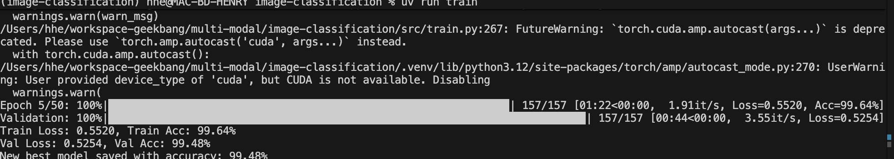

# CNN Image Classification Project

A PyTorch-based Convolutional Neural Network (CNN) for classifying images into 10 categories using ResNet34 architecture with transfer learning.



## Features

- **Multi-device support**: Automatic detection and utilization of CUDA, MPS (Apple Silicon), or CPU
- **Transfer learning**: Pre-trained ResNet34 backbone for better performance
- **Data augmentation**: Comprehensive image transformations for robust training
- **Mixed precision training**: Faster training with reduced memory usage
- **Comprehensive evaluation**: Detailed metrics, confusion matrices, and visualizations
- **Tensorboard logging**: Real-time training monitoring
- **Early stopping**: Prevents overfitting with configurable patience
- **Flexible configuration**: YAML-based configuration system

## Project Structure

```
image-classification/
├── src/
│   ├── data/
│   │   ├── __init__.py
│   │   └── dataset.py          # Custom dataset loader
│   ├── models/
│   │   ├── __init__.py
│   │   └── resnet.py           # ResNet-based model
│   ├── utils/
│   │   ├── __init__.py
│   │   ├── device.py           # Device detection utilities
│   │   └── metrics.py          # Evaluation metrics
│   ├── train.py                # Training script
│   └── evaluate.py             # Evaluation script
├── configs/
│   └── config.yaml             # Training configuration
├── data/
│   ├── images/                 # Image data directory
│   ├── re_id_1000_train.txt   # Training data file
│   └── re_id_1000_test.txt    # Test data file
├── models/                     # Saved model checkpoints
├── logs/                       # Training logs and tensorboard
├── results/                    # Evaluation results
├── pyproject.toml              # Project dependencies and configuration
└── README.md                   # This file
```

## Requirements

- Python 3.12+
- PyTorch 2.0+
- torchvision
- CUDA-capable GPU (optional, but recommended)
- Apple Silicon Mac with MPS support (optional)

## Installation

1. Clone the repository and navigate to the project directory:
   ```bash
   cd image-classification
   ```

2. Install dependencies using uv:
   ```bash
   uv sync
   ```

3. Activate the virtual environment:
   ```bash
   source .venv/bin/activate  # On macOS/Linux
   # or
   .venv\\Scripts\\activate     # On Windows
   ```

## Data Format

The project expects image data in the following format:

- **Training data file** (`data/re_id_1000_train.txt`): Contains paths to training images
- **Test data file** (`data/re_id_1000_test.txt`): Contains paths to test images
- **Image directory** (`data/images/`): Contains actual image files

Each line in the data files should follow the format:
```
category_id\\subfolder\\filename.jpg
```

Example:
```
1\\License_1\\4404000000002951513342.jpg
2\\License_2\\4404000000002951271571.jpg
```

## Usage

### Training

Train the model using the default configuration:
```bash
uv run train
```

Or with custom configuration:
```bash
uv run train --config configs/custom_config.yaml
```

### Evaluation

Evaluate a trained model:
```bash
uv run evaluate
```

Or evaluate a specific checkpoint:
```bash
uv run evaluate --checkpoint models/best.pth
```

### Monitoring Training

View training progress in real-time using Tensorboard:
```bash
tensorboard --logdir logs/tensorboard
```

## Configuration

The training behavior can be customized by modifying `configs/config.yaml`. Key sections include:

- **Data settings**: Batch size, image size, data paths
- **Model settings**: Architecture, dropout rate, pretrained weights
- **Training settings**: Learning rate, epochs, optimization parameters
- **Logging settings**: Checkpoint saving, Tensorboard logging

## Performance

The model is designed to achieve **>80% accuracy** on the test set through:

- Transfer learning with pre-trained ResNet34
- Data augmentation techniques
- Mixed precision training
- Learning rate scheduling
- Early stopping to prevent overfitting

## Results

After training, evaluation results will be saved in the `results/` directory, including:

- Comprehensive metrics (accuracy, precision, recall, F1-score)
- Confusion matrices (both raw and normalized)
- Per-class performance analysis
- Detailed predictions in JSON format

## Device Support

The project automatically detects and utilizes the best available compute device:

- **CUDA**: NVIDIA GPUs with CUDA support
- **MPS**: Apple Silicon Macs with Metal Performance Shaders
- **CPU**: Fallback for systems without GPU acceleration

## Troubleshooting

### Common Issues

1. **Out of memory errors**: Reduce batch size in `configs/config.yaml`
2. **Slow training**: Ensure CUDA/MPS is properly detected and utilized
3. **Poor accuracy**: Try adjusting learning rate, adding more epochs, or enabling data augmentation

### Device Detection

Check device detection:
```python
from src.utils.device import get_device, get_device_info
device = get_device()
print(get_device_info(device))
```

## License

This project is licensed under the MIT License.

## Contributing

1. Fork the repository
2. Create a feature branch
3. Make your changes
4. Add tests if applicable
5. Submit a pull request

## Acknowledgments

- PyTorch team for the excellent deep learning framework
- torchvision for pre-trained models and transforms
- ResNet architecture from "Deep Residual Learning for Image Recognition"
